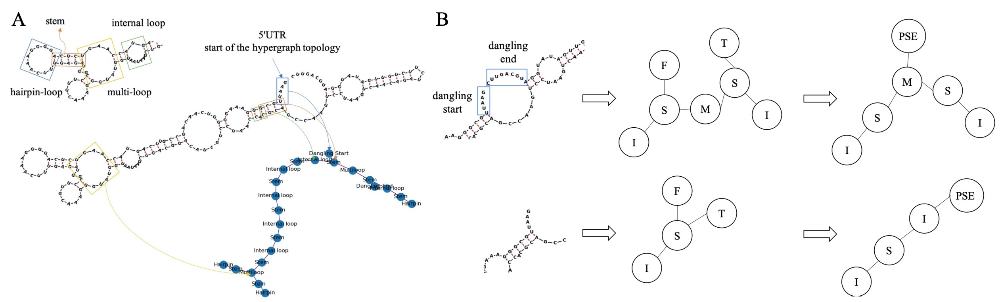
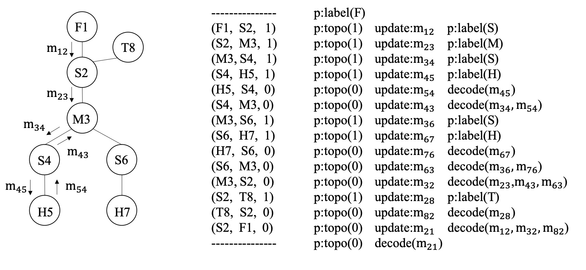

# Graph designing RNAs: a junction tree decomposed variational auto-encoding approach

This is a repository dedicated to the task of RNA inverse design, following a tree decomposed graph variational auto-encoding approach.

More information will be added as this project gradually moves towards its completion.

#### Tree decomposition of an RNA molecular graph into its equivalent junction tree representation 

#### Tree decoding stage: an example

Training mandates teacher forcing, whereas an autoregressive decoding scheme is recommended at the inference stage.

Main reference:

[Junction Tree Variational Autoencoder](https://github.com/wengong-jin/icml18-jtnn) 